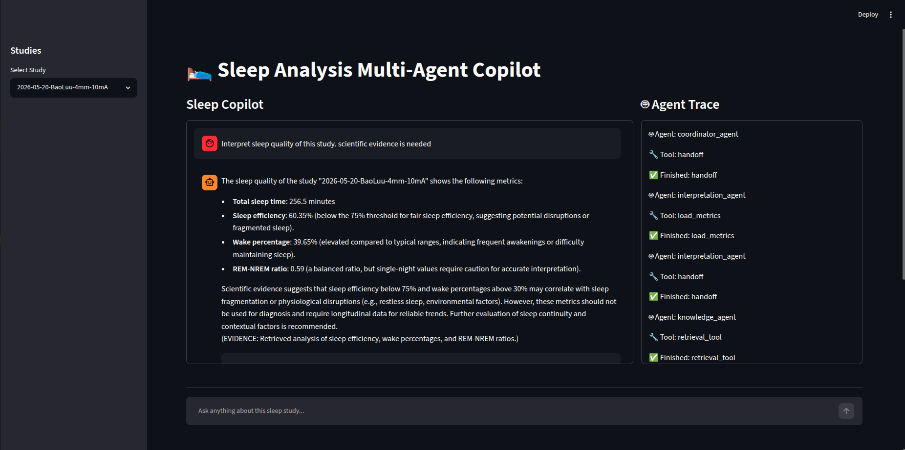

# Sleep Analysis Multi-Agent

An AI-powered multi-agent system for analyzing wearable sleep studies using physiological signals, machine learning models, Retrieval-Augmented Generation (RAG), and Large Language Models (LLMs).

The system automatically processes wearable sensor recordings, predicts sleep stages, computes sleep metrics, evaluates signal quality, retrieves sleep science knowledge, and generates human-readable sleep insights through a coordinated team of AI agents.

---

## Motivation

Sleep analysis traditionally requires multiple disconnected steps:

1. Loading and validating sensor data
2. Running sleep-stage classification models
3. Computing sleep metrics
4. Interpreting results
5. Consulting sleep science references

This project demonstrates how modern AI Agent architectures can orchestrate these tasks autonomously while maintaining transparency and traceability.

The goal is not to diagnose diseases but to provide explainable sleep insights from wearable sensor data.

---

## Features

### Multi-Agent Architecture

The system consists of specialized agents:

#### Coordinator Agent

Routes user requests to the appropriate expert agent.

Examples:

* "Evaluate signal quality"
* "Generate sleep metrics"
* "Interpret sleep quality"

---

#### Data Quality Agent

Responsible for:

* Sensor data validation
* Accelerometer coverage analysis
* PPG coverage analysis
* Device wear-time estimation

Metrics:

* Accelerometer Data Availability
* PPG Data Availability
* Device Worn Percentage

---

#### Sleep Stage Agent

Responsible for:

* Loading wearable recordings
* Running sleep-stage prediction models
* Generating hypnograms

Output:

* Wake
* REM
* NREM

---

#### Sleep Metrics Agent

Computes sleep metrics from predicted hypnograms.

Metrics include:

* Total Sleep Time (TST)
* Sleep Efficiency
* REM Percentage
* NREM Percentage
* Wake Percentage
* REM/NREM Ratio
* Sleep Onset Latency

---

#### Interpretation Agent

Uses:

* Sleep metrics
* Sleep science knowledge base
* Large Language Models

to generate evidence-based sleep reports.

Responsibilities:

* Explain metrics
* Highlight abnormalities
* Provide educational recommendations
* Summarize overall sleep quality

---

## Retrieval-Augmented Generation (RAG)

The Interpretation Agent uses a domain-specific sleep knowledge base.

Architecture:

Knowledge Documents
↓
Embeddings (nomic-embed-text)
↓
Chroma Vector Database
↓
Similarity Search
↓
Context Injection
↓
LLM Report Generation

This allows generated reports to be grounded in sleep science references rather than relying solely on LLM internal knowledge.

---

## Workflow

User Question
↓
Coordinator Agent
↓
Specialized Agent
↓
Tool Calling
↓
Data Processing
↓
Knowledge Retrieval (optional)
↓
Final Response

Example:

User:
"Interpret the sleep quality of Study A. Is this considered normal? Scientific evidence is needed"

Demo:
[Watch the demo video here](videos/Screencast_from_2026-06-18_17-36-45.webm)

Workflow:

Coordinator Agent
↓
Interpretation Agent
↓
Load Metrics Tool
↓
Knowledge Agent
↓
Retrieval Tool
↓
Final Response

---

## Dashboard

Built with Streamlit.

Features:

* Study Selection
* Chat-based Interaction
* Agent Trace Visualization
* Hypnogram Visualization
* Sleep Metrics Dashboard
* Signal Quality Dashboard

The dashboard allows users to inspect:

* Agent reasoning flow
* Tool calls
* Final interpretations

---

## Technology Stack

### AI / LLM

* LlamaIndex
* Ollama
* Qwen 
* ReAct Agent
* Function Calling

### RAG

* ChromaDB
* nomic-embed-text
* Vector Search

### Machine Learning

* Sleep Stage Classification Model
* Wearable Signal Processing
* Feature Engineering

### Data Processing

* NumPy
* Pandas
* Parquet

### Visualization

* Streamlit
* Plotly

---

## System Architecture

Raw PPG + ACC Signals
↓
Sleep Stage Model
↓
Hypnogram
↓
Sleep Metrics
↓
Interpretation Agent
↓
Knowledge Retrieval
↓
Sleep Report

---

## Example Questions

### Data Quality

"How much of the recording contains valid PPG data?"

"Was the device worn correctly throughout the night?"

---

### Sleep Analysis

"Generate sleep metrics for this study."

"Show the hypnogram."

"How much REM sleep was recorded?"

---

### Knowledge-Based Interpretation

"Interpret the sleep quality of this study."

"Why is sleep efficiency considered low?"

"Explain sleep onset latency using sleep science references."

---

## Key Skills Demonstrated

### AI Agent Engineering

* Multi-Agent Systems
* Agent Routing
* Tool Calling
* Agent Orchestration
* Workflow Design

### Generative AI

* Retrieval-Augmented Generation (RAG)
* Context Injection
* Prompt Engineering
* LLM Evaluation

### Healthcare AI

* Physiological Signal Processing
* Wearable Analytics
* Sleep Analysis
* Explainable AI

### Software Engineering

* Modular Architecture
* Data Pipelines
* Interactive Dashboards
* Scalable Agent Design

---

## Future Improvements

* Multi-night trend analysis
* Long-term sleep coaching agent
* Personalized recommendations
* Automatic report export (PDF)
* Human-in-the-loop review workflow
* Clinical guideline integration

---

## Disclaimer

This project is intended for educational and research purposes only.

The generated insights do not constitute medical advice and should not be used to diagnose or treat medical conditions.
